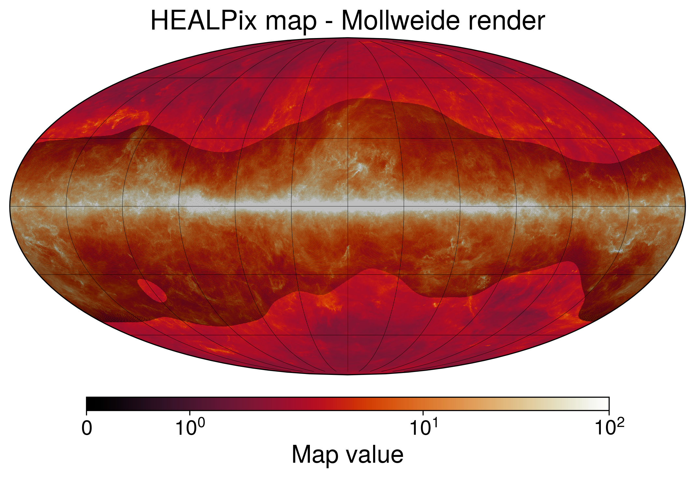
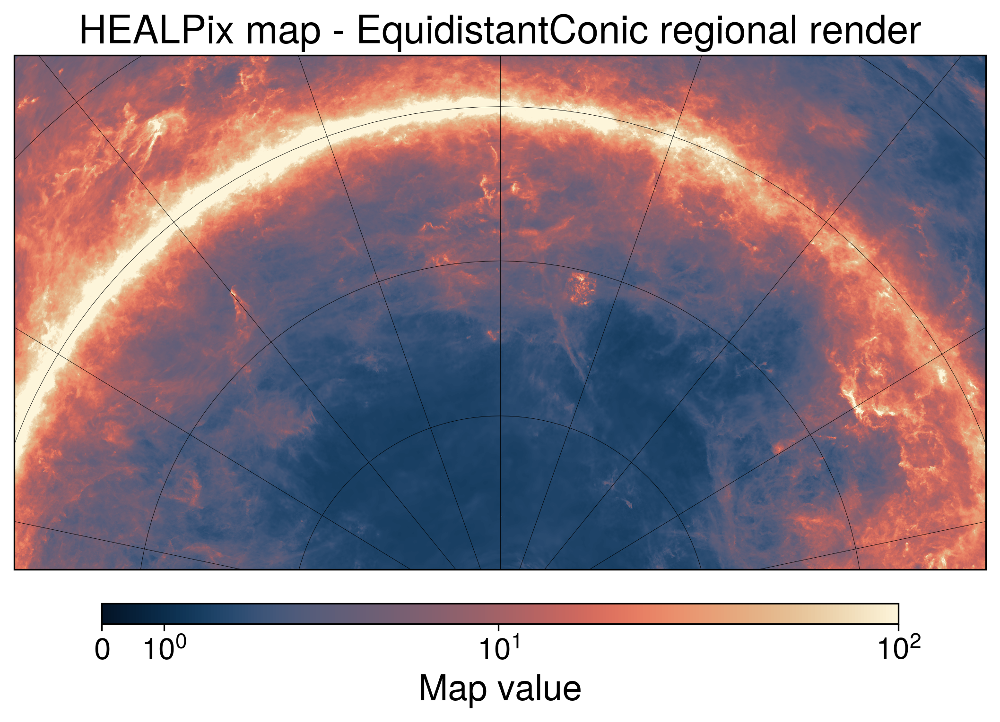
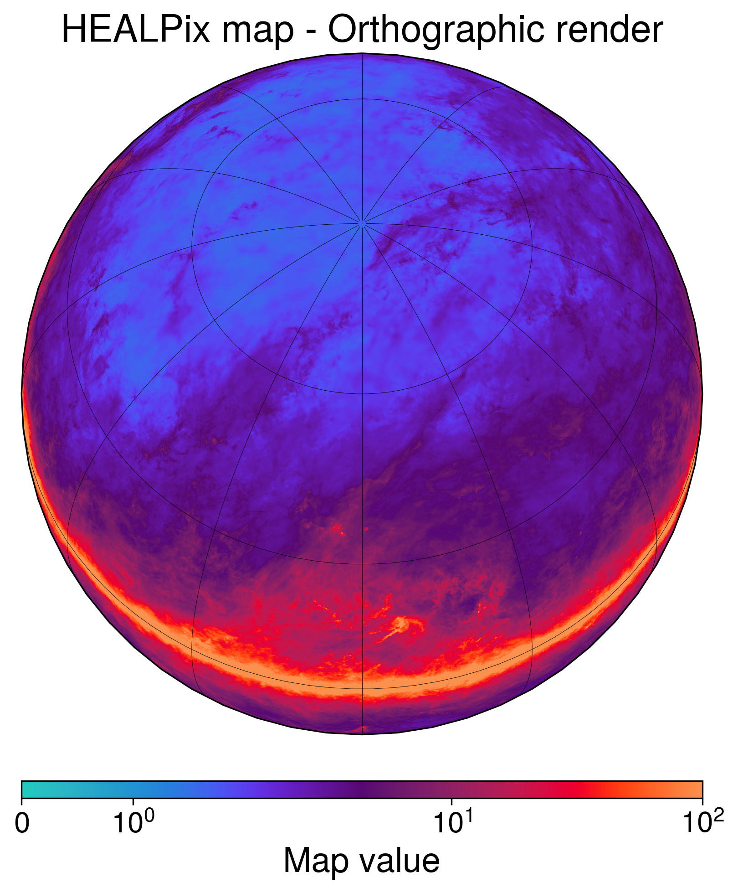
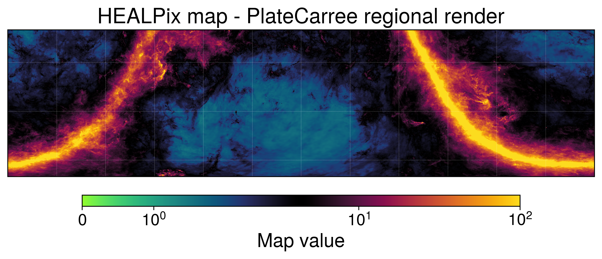
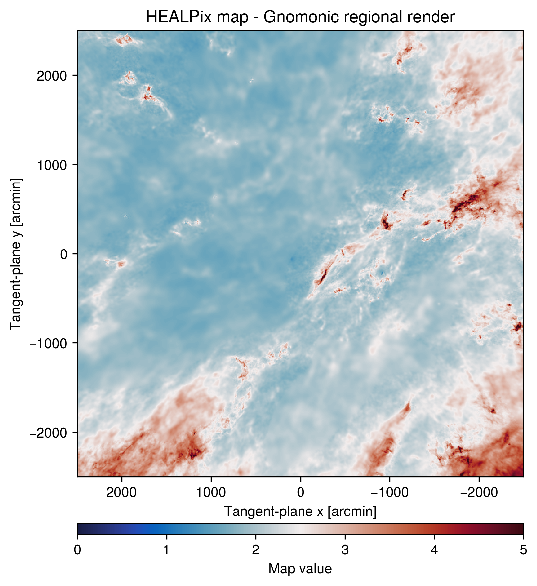

Usage
=====

This page follows the examples in ``notebooks/skyplot_package_test.ipynb``.
They render a HEALPix dust map, optionally overlay a Galactic-plane mask, and
then show the same data with each available sky projection.

Set up the map
----------------

Import the plotting functions and inspect the available projections and
sampling presets. ``resolution="high"`` is used by the notebook examples to
produce publication-sized renderings; use ``"low"`` or ``"medium"`` for
quicker previews.

.. code-block:: python

   from pathlib import Path

   import healpy as hp
   import matplotlib.colors as mpc
   import numpy as np

   from skyplot import (
       AVAILABLE_PROJECTIONS,
       FONT_SIZE_PRESETS,
       RESOLUTION_PRESETS,
       equidistantconic,
       gnomonic,
       mollweide,
       orthographic,
       platecarree,
       save_figure,
   )

   print("Available projections:", AVAILABLE_PROJECTIONS)
   print("Resolution presets:", RESOLUTION_PRESETS)
   print("Base font sizes (points):", FONT_SIZE_PRESETS)

Load a 1D HEALPix FITS map by setting ``map_path`` to a local file. The map
must contain the field selected by ``field``; the notebook uses the first
field, ``field=0``.

.. code-block:: python

   # Replace this with the path to your HEALPix FITS map.
   map_path = Path("path/to/your_healpix_map.fits")

   if not map_path.exists():
       raise FileNotFoundError(f"Set map_path to an existing file: {map_path}")

   hp_map = hp.read_map(map_path, field=0)
   print("Map loaded:", map_path)
   print("npix:", hp_map.size, "nside:", hp.get_nside(hp_map))
   print("dtype:", hp_map.dtype)

Mask overlay (optional)
-----------------------

The notebook also loads a Galactic-plane mask. It uses the mask only in the
Mollweide example below, where zero-valued pixels are painted as a translucent
overlay. Omit this cell and the second plotting call if no mask is needed.

.. code-block:: python

   mask_path = Path("path/to/your_mask.fits")
   mask = hp.read_map(mask_path, field=1)

Mollweide full-sky view
-----------------------

This full-sky view uses a symmetric-logarithmic scale to retain both faint and
bright map structure. The second call layers the optional mask onto the axes
created by the first call.

.. code-block:: python

   fig = mollweide(
       hp_map,
       resolution="high",
       cmap="sunburst",
       norm="symlog",
       vmin=0.0,
       vmax=100.0,
       badcolor=None,
       title="HEALPix map - Mollweide render",
   )

   mollweide(
       mask,
       resolution="high",
       cmap=None,
       vmin=0.0,
       vmax=1.0,
       ax=fig.axes[0],
       badcolor=None,
       overlay_mask=True,
       overlay_color="k",
       alpha=0.1,
       show_gridlines=False,
   )

   The notebook's Mollweide full-sky rendering.

Equidistant Conic regional view
-------------------------------

Use ``extent`` to select a region and set the conic's center and standard
parallels through ``projection_kwargs``. Here a ``SymLogNorm`` supplies more
control than the shorthand ``norm="symlog"``.

.. code-block:: python

   equidistantconic(
       hp_map,
       projection_kwargs={
           "central_longitude": -60.0,
           "central_latitude": -30.0,
           "standard_parallels": (-70.0, -15.0),
       },
       extent=(-150.0, 30.0, -80.0, 10.0),
       resolution="high",
       cmap="lipari",
       norm=mpc.SymLogNorm(
           linthresh=2.5, linscale=0.35, vmin=0.0, vmax=100.0
       ),
       title="HEALPix map - EquidistantConic regional render",
   )

   The notebook's regional Equidistant Conic rendering.

Orthographic view
-----------------

An Orthographic projection presents the sky as viewed from outside a globe.
Choose the displayed hemisphere with ``central_longitude`` and
``central_latitude``.

.. code-block:: python

   orthographic(
       hp_map,
       resolution="high",
       projection_kwargs={
           "central_longitude": 0.0,
           "central_latitude": 60.0,
           "azimuth": 0.0,
       },
       cmap="guppy_r",
       norm=mpc.SymLogNorm(
           linthresh=2.5, linscale=1.0, vmin=0.0, vmax=100.0
       ),
       badcolor=None,
       title="HEALPix map - Orthographic render",
   )

   The notebook's Orthographic rendering centered at longitude 0 and latitude 60 degrees.

Plate Carree coordinate transform
---------------------------------

This example displays a Galactic map on an ICRS/equatorial longitude-latitude
grid. ``coordinate_transform`` is ordered ``(source_frame, display_frame)``;
use Astropy frame strings such as ``"galactic"``, ``"icrs"``, and
``"geocentrictrueecliptic"``.

.. code-block:: python

   platecarree(
       hp_map,
       coordinate_transform=("galactic", "icrs"),
       extent=(-180.0, 180.0, -70.0, 20.0),
       resolution="high",
       cmap="wildfire",
       norm=mpc.SymLogNorm(
           linthresh=2.5, linscale=1.0, vmin=0.0, vmax=100.0
       ),
       badcolor=None,
       gridline_kwargs={"linewidth": 0.2, "color": "w", "linestyle": ":"},
       title="HEALPix map - PlateCarree regional render",
   )

   The notebook's Plate Carree rendering after transforming Galactic coordinates to ICRS.

Gnomonic detail view
--------------------

Gnomonic is intended for a small tangent-plane region. ``center`` gives the
longitude and latitude in degrees, while ``xsize``, ``ysize``, and
``pixel_size_arcmin`` set the output sampling.

.. code-block:: python

   gnomonic(
       hp_map,
       center=(0.0, 90.0),
       xsize=1000,
       ysize=1000,
       pixel_size_arcmin=5.0,
       cmap="balance",
       vmin=0.0,
       vmax=5.0,
       title="HEALPix map - Gnomonic regional render",
       figsize=(5.5, 6.5),
   )

   The notebook's Gnomonic detail view centered at longitude 0 and latitude 90 degrees.

Saving a figure
---------------

Each plotting function returns a Matplotlib figure. Pass that figure to
``save_figure`` to write an image.

.. code-block:: python

   save_figure(fig, "simulated_sky.png", figsize=(12, 6), dpi=300)
